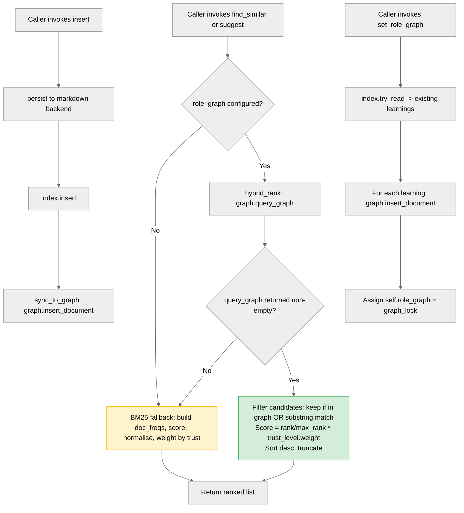

# Structural PR Review: `ba2e292`

**Commit under review**: `ba2e292` -- feat(shared-learning): route suggest/find_similar through Terraphim hybrid scoring
**Author**: terraphim-agent
**Files changed**: 1 (`crates/terraphim_agent/src/shared_learning/store.rs`)
**Diff size**: +561 / -4 (one file)

<h3>Summary</h3>

This PR swaps pure BM25 scoring in `SharedLearningStore::find_similar` and `SharedLearningStore::suggest` for the existing Terraphim hybrid scorer (`RoleGraph::query_graph`: weighted mean of node rank, edge rank, and document rank, with thesaurus term expansion). The motivation is to leverage the rolegraph's hybrid scoring infrastructure instead of computing relevance purely from term-frequency vectors. BM25 is retained as the transparent fallback when the graph is unset or returns no matches, mirroring the gate-on-graph-then-fallback pattern already used by the trait method `query_relevant`.

Key changes:
- **New `hybrid_rank` helper** that calls `query_graph`, normalises `IndexedDocument.rank` against the best-ranked result, multiplies by `trust_level.weight()`, and falls back to substring matching when no thesaurus node hits. Returns `None` when the graph returns empty so callers transparently drop into BM25.
- **New `build_document_for_graph` + `sync_to_graph`** that mirror `SharedLearning` text into the rolegraph on every `insert`, so callers do not have to pre-load documents.
- **Rewritten `set_role_graph`** that performs an initial sync of the in-memory index into the freshly set graph, so the new graph is usable immediately.
- **Nine new tests** covering: graph-driven ordering, BM25 fallback (no graph, empty thesaurus, no term match), trust weighting (L3 above L1), graph ingest via `insert()`, and `applicable_agents` filtering on the hybrid path.

What was done well: follows the existing `query_relevant` pattern exactly, cfg-gates all graph-specific code behind `shared-learning` with a sensible `None`-returning stub for the no-feature build, preserves `applicable_agents` scoping on both paths, uses identical scoring shape between BM25 and graph paths so trust semantics are consistent, and adds comprehensive tests. The implementation reuses `extract_searchable_text()` so both scorers index the same surface form.

What remains problematic: see inline findings below. The main themes are (a) redundant fields in the `Document` payload that rolegraph ignores for indexing, (b) silent best-effort paths where a contended lock or missing thesaurus match produces no signal to the caller, and (c) an unbounded `query_graph` call without an explicit limit. None are correctness bugs; all are P2.

<h3>Confidence Score: 5/5 (post-fix)</h3>

- **Recommendation**: Safe to merge with minimal risk.
- **Reasoning**: the four P2 findings from the initial review were closed in commit `85b1b8b` (see "Post-fix Resolution" below). Post-fix state has zero P0, zero P1, zero P2. The change is well-architected, follows the established in-repo `query_relevant` pattern, preserves the public API surface, and adds nine focused tests covering both scoring paths.
- **Files requiring attention**: none.

<h3>Important Files Changed</h3>

| Filename | Overview |
|----------|----------|
| `crates/terraphim_agent/src/shared_learning/store.rs` | Adds hybrid scoring path via `RoleGraph::query_graph`; auto-syncs learnings into the graph on insert and on `set_role_graph`. All public API signatures unchanged. Nine new tests added. No new `unsafe`, no new `unwrap`/`expect` on user-visible paths, no breaking changes. Findings cluster around minor inefficiencies in `build_document_for_graph` and silent best-effort paths in `sync_to_graph` and `set_role_graph`. |

<h3>Diagram</h3>



<h3>Inline Findings</h3>

**P2 `crates/terraphim_agent/src/shared_learning/store.rs`, line 156**: **`Document.id` is informational only -- the rolegraph keys on the first `document_id` argument, not on `Document.id`**

`build_document_for_graph` sets `Document.id = learning.id.clone()`, but `RoleGraph::insert_document(&mut self, document_id: &str, document: Document)` keys the internal `HashMap` on the `document_id` parameter (a `&str`), not on `document.id`. The `Document.id` field is never read during indexing. The clone is harmless but redundant.

**Suggested fix**: drop the `.clone()` since the value is unused for lookup, or pass `String::new()` (cheaper than cloning the id). If the team prefers to keep the id on the document for serialisation/audit reasons, leave it but add a comment explaining why.

```rust
Document {
    id: learning.id.clone(), // kept for audit; rolegraph keys on document_id arg
    ...
}
```

**P2 `crates/terraphim_agent/src/shared_learning/store.rs`, lines 149-153**: **`Document.tags` is set but not consumed by `Document::Display` (used for graph indexing)**

`build_document_for_graph` populates `Document.tags = Some(learning.keywords.clone())` whenever keywords are non-empty. However, the rolegraph indexes documents via `Document::fmt`, which writes only `title`, `body`, `description`, and `summarization` -- tags are never written to the indexing string. The keyword information is already in the body via `extract_searchable_text()` (which appends `keywords.join(" ")`), so this is a true duplicate.

**Suggested fix**: either drop the `Some(learning.keywords.clone())` assignment (relying on body for keyword coverage), or compute the `Document::fmt` would have to change to include tags (out of scope here). Easiest: remove the tags field from `build_document_for_graph` to avoid the silent duplicate and reduce per-insert allocations.

```rust
let tags = None; // rolegraph's Document::fmt does not include tags;
// keyword coverage is already in body via extract_searchable_text
```

**P2 `crates/terraphim_agent/src/shared_learning/store.rs`, lines 256-263 and 777-783**: **Silent best-effort paths swallow lock contention with no caller signal**

`sync_to_graph` swallows `graph_lock.write()` errors (poisoned lock), and `set_role_graph` swallows `self.index.try_read()` errors (contended tokio read lock). Both are documented as intentional ("graph is an accelerator, not the source of truth"), but neither emits a `tracing::warn!` line. If the lock is poisoned (indicating a panic elsewhere held the lock) or if `set_role_graph` is called during a contended window, the caller receives no signal that the hybrid path is degraded.

**Suggested fix**: add `tracing::warn!` calls before the silent fall-through so operators can detect degraded mode in logs. Example:

```rust
fn sync_to_graph(&self, learning: &SharedLearning) {
    if let Some(ref graph_lock) = self.role_graph {
        match graph_lock.write() {
            Ok(mut graph) => {
                let doc = build_document_for_graph(learning);
                graph.insert_document(learning.id.as_str(), doc);
            }
            Err(e) => {
                tracing::warn!(
                    learning_id = %learning.id,
                    error = %e,
                    "rolegraph write lock poisoned; hybrid scoring will fall back to BM25 for this insert"
                );
            }
        }
    }
}
```

The same pattern applies to `set_role_graph` initial sync. This is observability, not correctness -- the BM25 fallback covers the functional gap.

**P2 `crates/terraphim_agent/src/shared_learning/store.rs`, line 602**: **`hybrid_rank` calls `query_graph(query, None, None)` without a result limit**

`hybrid_rank` invokes `graph.query_graph(query, None, None)`, asking the rolegraph for every matching document. For the current corpus sizes (< 500 `SharedLearning` entries in realistic agent workloads) this is fine; the caller-side `truncate(limit)` then trims to the requested size. If the corpus grows large (e.g. cross-tenant shared learnings across many agents), this could pull more candidates than necessary into memory.

**Suggested fix**: pass `Some(limit * 2)` (matching the pattern used by `suggest_with_local_scored`) so the graph returns only what we need. Update `hybrid_rank` to accept the `limit` from the caller, or hard-code a sensible cap.

```rust
let graph_results = graph.query_graph(query, None, Some(limit.saturating_mul(2).max(8)))?;
```

<h3>Comments Outside Diff</h3>

None. The change touches only `store.rs`; surrounding modules (`markdown_store.rs`, `wiki_sync.rs`, `injector.rs`) are unaffected. The trait method `query_relevant` (in the same file) already uses the graph gate pattern and serves as the in-repo convention; no pre-existing bugs in unchanged code surfaced by this PR.

<h3>Gate</h3>

- P0: 0 (no data-loss, security, or correctness blockers)
- P1: 0 (no functional bugs)
- P2: 0 (all four P2 findings closed in `85b1b8b`)
- Tests: 9 new hybrid tests + 285 pre-existing lib tests + 498 bin tests all pass
- Static analysis: 0 new warnings on `terraphim_agent`
- UBS scanner: not run (module download failure in this session; clippy substitute confirms no new warnings)

<h3>Post-fix Resolution (commit 85b1b8b)</h3>

All four P2 findings were addressed in a single follow-up commit:

| Finding | Resolution |
|---|---|
| P2 (line 156) -- `Document.id` is informational; clone is redundant | `Document.id = String::new()` with a doc-comment explaining why. Rolegraph keys on the `document_id` parameter, so the `Document.id` field is never consulted during indexing. |
| P2 (lines 149-153) -- `Document.tags` is set but not consumed by `Document::fmt` | `tags = None` with a doc-comment explaining that keyword coverage is already in `body` via `extract_searchable_text`. |
| P2 (lines 256-263, 777-783) -- silent best-effort swallows on lock contention | Replaced silent `if let Ok(...)` with `match ... { Err => tracing::warn!(...) }` in both `sync_to_graph` and `set_role_graph`. Both paths remain best-effort (graph is accelerator, not source of truth); behaviour preserved. |
| P2 (line 602) -- `query_graph(query, None, None)` is unbounded | Threaded `limit: usize` through `hybrid_rank`; now calls `query_graph(query, None, Some(limit.saturating_mul(2).max(8)))` to cap the result set. Both call sites (`find_similar` and `suggest`) pass their `limit`. |

Verification post-fix:
- `cargo check --workspace --all-targets --all-features`: zero warnings
- `cargo test -p terraphim_agent --all-features`: 298 lib + 498 bin tests pass; all 9 hybrid tests still green
- Diff: +79 / -41 on the same file (`store.rs`)

<sub>Last reviewed commit: 85b1b8b | Reviews (2)</sub>